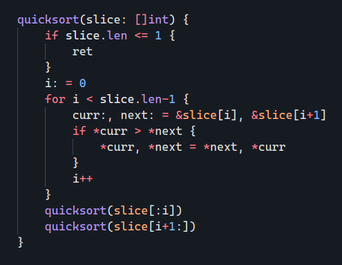
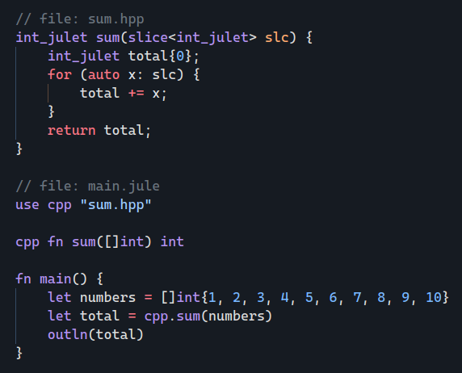

<div align="center">
<p>
    
</p>
<h2>The X Programming Language</h2>

[Website](https://the-xlang.github.io/website/) |
[Documentations](https://the-xlang.github.io/website/pages/docs.html) |
[Contributing](https://the-xlang.github.io/website/pages/contributing.html)

</strong>
</div>

<h2 id="motivation">Motivation</h2>

X is a statically typed compiled programming language designed for system development, building maintainable and reliable software.
The purpose of X is to keep functionality high while maintaining a simple form and readability.
It guarantees memory safety and does not contain undefined behavior.



<h2 id="memory-safety">Memory Safety and Management</h2>
The memory safety and the memory management.
A major challenge in the C and C++ or similar programming languages.
X guarantees memory safety and uses reference counting for memory management.
An account-allocation is automatically released as soon as the reference count reaches zero.
There are no dangling pointers, and accessing a null pointer will obviously get you an error.
<br><br>

+ Instant automatic memory initialization
+ Bounds checking
+ Null checking

<h2 id="cpp-interoperability">C++ Interoperability</h2>
X is designed to be interoperable with C++.
A C++ header file dependency can be added to the X code and its functions can be linked.
It's pretty easy to write C++ code that is compatible with the X code compiled by the compiler.
XXC keeps all the C++ code it uses for X in its <a href="https://github.com/the-xlang/xxc/tree/main/api">api</a> directory.
<ol></ol> <!-- for space -->


<h2 id="goals">Goals</h2>

+ Simplicity and maintainability
+ Fast and scalable development
+ Performance-critical software
+ Memory safety
+ As efficient and performance as C++
+ High C++ interoperability

<h2 id="what-is-xxc">What is XXC?</h2>
XXC is the name of the reference compiler for the X programming language. <br>
It is the original compiler of the X programming language. <br>
The features that XXC has is a representation of the official and must-have features of the X programming language.

<h2 id="about-project">About Project</h2>
XXC, the reference compiler for X, is still in development.
Currently, it can only be built from source.
Due to the fact that it is still under development, there may be changes in the design and syntax of the language.
<br><br>
It is planned to rewrite the compiler with X after reference compiler reaches sufficient maturity.
XXC has or is very close to many of the things X was intended to have, such as memory safety, properties, structures with methods and generics.
<br><br>
Currently, project structure, its lexical and syntactic structure has appeared.
However, when the reference compiler is rewritten with X, it is thought that AST, Lexer and some packages will be included in the standard library.
This will be a change that will cause the official compiler's project structure to be rebuilt.
The reference compiler will probably use the standard library a lot.
This will also allow developers to quickly develop tools for the language by leveraging X's standard library.

<h2 id="documentations">Documentations</h2>

All documentation about XXC (naturally X programming language) is on the website. <br>
[See Documentations](https://the-xlang.github.io/website/pages/docs.html)

<h2 id="os-support">OS Support</h2>

<table>
    <tr>
        <td><strong>Operating System</strong></td>
        <td><strong>Transpiler</strong></td>
        <td><strong>Compiler</strong></td>
    </tr>
    <tr>
        <td>Windows</td>
        <td>Supports</td>
        <td>Not supports yet</td>
    </tr>
    <tr>
        <td>Linux</td>
        <td>Supports</td>
        <td>Not supports yet</td>
    </tr>
    <tr>
        <td>MacOS</td>
        <td>Supports</td>
        <td>Not supports yet</td>
    </tr>
</table>

<h2 id="building-project">Building Project</h2>

> [Website documentation](https://the-xlang.github.io/website/pages/docs.html?page=getting-started-install-from-source) for install from source.

There are scripts prepared for compiling of XXC. <br>
These scripts are written to run from the home directory.

`build` scripts used for compile. <br>
`brun` scripts used for compile and execute if compiling is successful.

[Go to scripts directory](scripts)

XXC aims to have a single main build file. <br>
XXC is in development with the [Go](https://github.com/golang/go) programming language. <br>

### Building with Go Compiler

#### Windows - PowerShell
```
go build -o xxc.exe -v cmd/xxc/main.go
```

#### Linux - Bash
```
go build -o xxc -v cmd/xxc/main.go
```

Run the above command in your terminal, in the XXC project directory.

<h2 id="project-build-state">Project Build State</h2>

<table>
    <tr>
        <td><strong>Operating System</strong></td>
        <td><strong>State</strong></td>
    </tr>
    <tr>
        <td>Windows</td>
        <td>
            <a href="https://github.com/the-xlang/xxc/actions/workflows/windows.yml">
                
            </a>
        </td>
    </tr>
    <tr>
        <td>Ubuntu</td>
        <td>
            <a href="https://github.com/the-xlang/xxc/actions/workflows/ubuntu.yml">
                
            </a>
        </td>
    </tr>
    <tr>
        <td>MacOS</td>
        <td>
            <a href="https://github.com/the-xlang/xxc/actions/workflows/macos.yml">
                
            </a>
        </td>
    </tr>
</table>

<h2 id="contributing">Contributing</h2>

Thanks for you want contributing to XXC!
<br><br>
The XXC project use issues for only bug reports and proposals. <br>
To contribute, please read the contribution guidelines from <a href="https://the-xlang.github.io/website/pages/contributing.html">here</a>. <br>
To discussions and questions, please use <a href="https://github.com/the-xlang/xxc/discussions">discussions</a>.

<h2 id="code-of-conduct">Code of Conduct</h2>

[See Code of Conduct](https://the-xlang.github.io/website/pages/code_of_conduct.html)

<h2 id="license">License</h2>

The XXC and standard library is distributed under the terms of the BSD 3-Clause license. <br>
[See License Details](https://the-xlang.github.io/website/pages/license.html)
